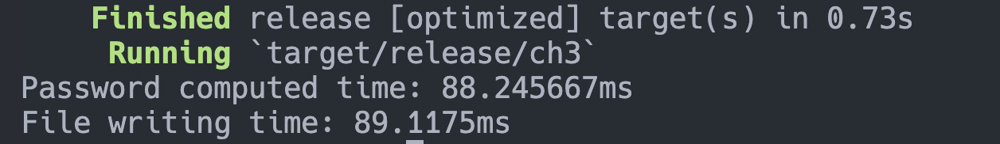

## Hardware Specification

- CPU: Apple M1
- RAM: 16GB
- OS: macOS 14.0 (23A344)

## 1. Write a simple python program to use the word from the dictionary to find the original value of `d54cc1fe76f5186380a0939d2fc1723c44e8a5f7`.

```python
import hashlib
from itertools import product


def generate_combinations(word):
    mapping = {
        "a": ["a", "A", "4"],
        "b": ["b", "B", "8"],
        "c": ["c", "C"],
        "d": ["d", "D", "6"],
        "e": ["e", "E", "3"],
        "f": ["f", "F"],
        "g": ["g", "G", "9"],
        "h": ["h", "H"],
        "i": ["i", "I"],
        "j": ["j", "J"],
        "k": ["k", "K"],
        "l": ["l", "L", "1"],
        "m": ["m", "M"],
        "n": ["n", "N"],
        "o": ["o", "O", "0"],
        "p": ["p", "P"],
        "q": ["q", "Q", "9"],
        "r": ["r", "R"],
        "s": ["s", "S", "5"],
        "t": ["t", "T", "7"],
        "u": ["u", "U"],
        "v": ["v", "V"],
        "w": ["w", "W"],
        "x": ["x", "X"],
        "y": ["y", "Y"],
        "z": ["z", "Z", "2"],
    }

    char_combinations = []

    for char in word:
        char_combinations.append(mapping.get(char, [char]))

    all_combinations = [
        "".join(combination) for combination in product(*char_combinations)
    ]

    return all_combinations


target_hash = "d54cc1fe76f5186380a0939d2fc1723c44e8a5f7"


with open("data/common-passwords.txt", "r") as f:
    found = False
    for line in f:
        password = line.strip()
        # combination of password with lowercase and uppercase
        password_combination = generate_combinations(password)
        # write combination to new file
        for pw in password_combination:
            print(f"Trying: {pw}")
            if hashlib.sha1(pw.encode()).hexdigest() == target_hash:
                print(pw)
                found = True
                break
        if found:
            break

```

However, in the actual implementation. I re-wrote the python implemtation in Rust for performance and added multi-threading to utilize multiple CPU cores.

```rust
// main.rs
mod combinations;
mod core;
mod hash;

use crate::core::find_hash;
use rayon::prelude::*;
use std::{
    fs::{File, OpenOptions},
    io::{BufRead, BufReader, Write},
    sync::atomic::Ordering,
    sync::{atomic::AtomicBool, Arc, Mutex},
};

fn main() -> std::io::Result<()> {
    static FILENAME: &str = "./data/common-passwords.txt";
    static OUT_FILE: &str = "./data/password.txt";
    static DESIRED_HASH: &str = "d54cc1fe76f5186380a0939d2fc1723c44e8a5f7";
    static CHUNK_SIZE: usize = 100;

    let file = File::open(FILENAME)?;
    let reader = BufReader::new(file);

    let results: Arc<Mutex<Vec<_>>> = Arc::new(Mutex::new(Vec::new()));
    let is_found = Arc::new(AtomicBool::new(false));

    let tick = std::time::Instant::now();

    reader
        .lines()
        .filter_map(Result::ok)
        .collect::<Vec<_>>()
        .chunks(CHUNK_SIZE)
        .par_bridge()
        .for_each(|chunk| {
            if is_found.load(Ordering::Relaxed) {
                return;
            }
            for password in chunk {
                if let Some(result) = find_hash(&password, &is_found, DESIRED_HASH) {
                    let mut results_lock = results.lock().unwrap();
                    results_lock.push(result);
                    is_found.store(true, Ordering::Relaxed);
                    break;
                }
            }
        });

    let results_lock = results.lock().unwrap();
    let mut file = OpenOptions::new().write(true).create(true).open(OUT_FILE)?;
    for line in &*results_lock {
        writeln!(file, "{}", line)?;
    }

    let tock = std::time::Instant::now();

    println!("Time elapsed: {:?}", tock - tick);

    Ok(())
}
```

```rust
// core.rs
use std::sync::atomic::{AtomicBool, Ordering};
use std::sync::{Arc, Mutex};

use crate::combinations::generate_combinaton_catesian_product;
use crate::hash;

pub fn find_hash(password: &String, is_found: &AtomicBool, hash: &str) -> Option<String> {
    let combinations = generate_combinaton_catesian_product(password);

    for combination in combinations {
        if is_found.load(Ordering::Relaxed) {
            return None; // Early exit if result is found
        }
        if hash::hash(&combination) == hash {
            return Some(combination);
        }
    }

    None
}

pub fn generate_hash_pw(password: &str) -> Vec<(String, String)> {
    let combinations = generate_combinaton_catesian_product(password);

    let mut hash_pw_pairs: Vec<(String, String)> = Vec::new();

    for combination in combinations {
        hash_pw_pairs.push((hash::hash(&combination), combination));
    }

    hash_pw_pairs
}
```

```rust
// combination.rs
use itertools::Itertools;
use std::collections::HashMap;

pub fn generate_combinaton_catesian_product(password: &str) -> Vec<String> {
    let substitutions = HashMap::from([
        ('a', vec!['a', 'A', '4']),
        ('b', vec!['b', 'B', '8']),
        ('c', vec!['c', 'C']),
        ('d', vec!['d', 'D', '6']),
        ('e', vec!['e', 'E', '3']),
        ('f', vec!['f', 'F']),
        ('g', vec!['g', 'G', '9']),
        ('h', vec!['h', 'H']),
        ('i', vec!['i', 'I', '1']),
        ('j', vec!['j', 'J']),
        ('k', vec!['k', 'K']),
        ('l', vec!['l', 'L', '1']),
        ('m', vec!['m', 'M']),
        ('n', vec!['n', 'N']),
        ('o', vec!['o', 'O', '0']),
        ('p', vec!['p', 'P']),
        ('q', vec!['q', 'Q']),
        ('r', vec!['r', 'R']),
        ('s', vec!['s', 'S', '5']),
        ('t', vec!['t', 'T', '7']),
        ('u', vec!['u', 'U']),
        ('v', vec!['v', 'V']),
        ('w', vec!['w', 'W']),
        ('x', vec!['x', 'X']),
        ('y', vec!['y', 'Y']),
        ('z', vec!['z', 'Z', '2']),
    ]);

    let char_vectors: Vec<Vec<char>> = password
        .chars()
        .map(|c| {
            substitutions
                .get(&c.to_ascii_lowercase())
                .cloned()
                .unwrap_or_else(|| vec![c.to_ascii_lowercase()])
        })
        .collect();

    let all_combinations = char_vectors
        .into_iter()
        .multi_cartesian_product()
        .map(|chars| chars.into_iter().collect::<String>())
        .collect();

    all_combinations
}
```

The implementation in rust yields in average of `~88 ms` to find the passsword where the answer of the hash is `ThaiLanD`.



## 2. For the given dictionary, create a rainbow table (including the substituted strings) using the sha1 algorithm. Measure the time for creating such a table. Measure the size of the table.

- Time to create table: 88 seconds
- Table Size: 14,503,157 Entries

Please note that huge chunk of the time is spent on writing to the file. If we remove the writing to file part, the time to create the table is only 1.78 seconds.

## 3. Based on your code, how long does it take to perform a hash (sha1) on a password string? Please analyze the performance of your system.

Hashing time: 45µs

## 4. If you were a hacker obtaining a password file from a system, estimate how long it takes to break a password with brute force using your computer. (Please based the answer on your measurement from exercise #3.)

Assuming that the password is 8 characters long and the password only contains lowercase letters, uppercase letters, or numbers. The total number of combinations is (26 + 26 + 10)^8 = 218,340,105,584,896. If we assume that the hashing time is 45µs, then it will take 9,825,304,751.32032 seconds or around 311 years to brute force the password. (This is with assumption that the hacker do not have any prior knowledge of the password)

## 5. Base on your analysis in exercise #4, what should be the proper length of a password. (e.g.Take at least a year to break).

The password is already strong enough. However, if we want to make it even stronger, we can increase the length of the password or add special characters to the password such as `!@#$%^&*()_+`.

## 6. What is salt? Please explain its role in protec#ng a password hash.

Salt is used to prevent the attacker from using rainbow table to crack the password. It is a random string that is added to the password before hashing. It is then stored together with the password before hash thus rendering the known password to be useless if the attacker does not know the salt.
